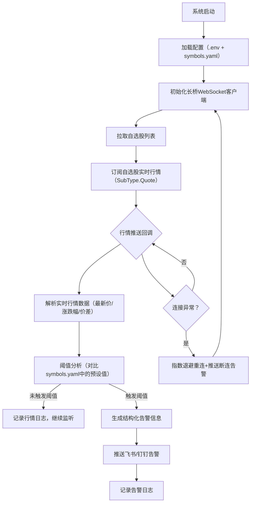
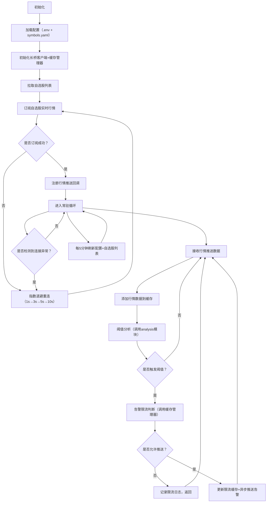

### 核心需求
基于已实现的自选股查询功能，搭建**服务器端7x24小时实时监控系统**：
1. 自动拉取长桥自选股列表，订阅所有标的的实时行情（WebSocket推送）；
2. 行情数据实时解析，按预设阈值（涨跌幅/价差）分析，触发条件立即推送告警；
3. 系统常驻后台运行，支持断线重连、故障自愈，日志完整可追溯；
4. 配置支持热更新，无需重启程序即可调整监控阈值/标的。

## 一、整体实现方案（核心逻辑）



## 2. 核心模块开发指南

### 2.1 实时行情订阅 (`src/monitor/quote_monitor.py`)
* **自选股自动拉取**：
    * 功能：基于拉取的自选股列表，批量订阅实时行情，支持动态更新订阅列表
    * 核心函数：
    ```python
    def subscribe_watchlist_quote(client: LongPortClient, is_first_push: bool = True) -> None:
        """
        - 订阅自选股实时行情
        :param client: 初始化后的长桥客户端
        :param is_first_push: 是否首次订阅时推送当前行情
        :raises: API调用异常、订阅失败异常
        """
    ```
    * 关键逻辑：
        - 拉取自选股列表后，提取标的代码去重；
        - 调用长桥订阅接口，指定 SubType.Quote（实时行情）；
        - 支持 “增量订阅”：新增自选股时无需取消原有订阅，直接追加；
        - 断线后自动重新拉取自选股列表并重新订阅。  


### 2.2 行情推送处理模块（src/api/longport/push/watchlist.py）
* 功能：统一处理自选股行情推送数据，解析 + 阈值判断
* 核心函数：
    ```python
    def handle_watchlist_quote(quote: PushQuote, threshold_config: dict) -> tuple[bool, dict]:
        """
        - 处理自选股行情推送，判断是否触发阈值
        :param quote: 长桥推送的行情数据
        :param threshold_config: 阈值配置（涨跌幅/价格区间）
        :return: (是否触发阈值, 结构化行情数据)
        """
    ```
* 阈值规则（可配置）：
    * 涨跌幅阈值：如单日涨 / 跌幅≥5%；
    * 价格区间阈值：如股价突破预设上限 / 下限；

### 2.3 告警推送模块（src/api/dingtalk.py）
* 功能：封装钉钉推送逻辑，支持结构化告警信息
* 同一标的+同一触发原因，单个美股交易日内仅推送1次，无需按分钟限流，兼顾易用性和防刷屏需求。

* 告警信息格式（统一）：
    ```
    * 标题：`[LongBridge Alert] {触发阈值}`
    * 内容：【美股自选股监控告警】
    * 标的：US.AAPL（苹果公司）
    * 最新价：189.5 USD
    * 涨跌幅：+1.2%（昨收：187.2 USD）
    * 触发规则：涨幅≥2%
    * 更新时间：2026-02-14 10:30:25
    ```
- 关键逻辑：
    - **异步推送** : 避免阻塞行情处理；
    - **推送失败时自动重试（最多 3 次）**: 重试失败记录 ERROR 日志。
    - **重复推送过滤**：
        - 同一标的同一触发原因，在一个交易日（美东时间周一至周五 9:30-16:00（对应北京时间周二至周六 21:30-4:00）内仅推送1次，避免刷屏。
        - 判断当前是否在美股交易日，每日收盘后自动清空去重缓存。
### 2.3.1 告警去重逻辑优化要求
1. 去重缓存字典设计：
   - Key格式：`{标的代码}_{原因类型}`（如`US.LEGN_price_change_rate`、`US.AAPL_bid_ask_spread`）；
   - Value：上次推送的时间戳（整数，单位：秒）；
   - 原因类型仅包含2类核心维度：`price_change_rate`（涨跌幅）、`bid_ask_spread`（买卖价差），避免维度过多导致去重失效。

2. 代码实现位置：
   - 在`src/api/feishu.py`/`src/api/dingtalk.py`的推送函数前，新增去重校验逻辑；
   - 去重缓存字典需定义为**全局变量**（或单例类属性），确保程序运行期间缓存不丢失。

## 2.4 服务常驻模块（src/monitor/watchlist_monitor.py）
### 2.4.1 功能与职责
功能：作为美股自选股实时监控系统的**核心常驻模块**，负责串联“自选股拉取→行情订阅阈值分析→告警触发”全流程，实现7×24小时无间断运行，同时具备断线重连、故障自愈、缓存管理能力。
```python
async def start_watchlist_monitor() -> None:
    """
    - 启动自选股实时监控服务
        - 初始化长桥WebSocket客户端
        - 拉取自选股列表
        - 订阅自选股实时行情（SubType.Quote）
        - 阈值分析：对比当前行情与预设阈值，判断是否触发告警
        - 触发告警时，调用告警管理器发送钉钉告警
    - 保持连接常驻
    - 指数退避重连
        - 连接异常（如网络中断）时，按指数退避策略 （1s、2s、4s、8s）重试，最大重试次数3次；
        - 每次重试前，调用告警管理器发送断连告警。
    """
```

### 2.4.2 核心设计目标
| 设计目标         | 具体要求                                                                 |
|------------------|--------------------------------------------------------------------------|
| 稳定性           | 支持指数退避重连、异常自动恢复，7×24小时运行无崩溃                       |
| 实时性           | 行情推送处理延迟≤300ms，告警触发后5秒内推送                             |
| 内存可控         | 拆分行情缓存/告警限流缓存，差异化清理，内存占用≤512MB                    |
| 可维护性         | 核心逻辑模块化，异常日志清晰，支持配置热更新                             |
| 线程安全         | 多线程（行情推送/缓存清理）操作无数据错乱                               |

### 2.4.3 核心流程


### 2.4.4 关键特性实现
1. **指数退避重连**
    - 重试间隔：1s→2s→4s→8s→10s（最大 10 秒），避免频繁重试被限流；
    - 重试阈值：最多 5 次，超过则推送告警并停止重试；
    - 重连前先取消原有订阅，避免重复订阅导致数据重复。
2. **配置热更新**
    - 每 5 分钟自动刷新symbols.yaml配置，无需重启服务；
    - 刷新失败仅记录日志，保证服务不中断；
    - 限流时间、阈值参数实时生效。
3. **自选股热更新**
    - 每 5 分钟重新拉取自选股列表，对比旧列表；
    - 若列表变化，自动重新订阅，适配自选股新增 / 删除。
4. **告警限流 + 异步推送**
    - 基于CacheManager实现 “标的 + 原因” 双维度限流；
告警推送通过asyncio.create_task异步执行，不阻塞行情处理；
推送失败自动重试（由DingTalkAlert实现）。

## 2.5 系统服务封装文档（watchlist-monitor.service）
1. **必要性**：systemd服务是生产级常驻程序的标配，相比nohup脚本，能实现开机自启、异常重启、权限管控、日志集成，大幅降低运维成本；
2. **核心价值**：即使服务器重启/程序崩溃，系统也能自动恢复运行，保证监控系统7×24小时不中断；
3. **校验关键**：重点验证“开机自启”“异常重启”“权限管控”三项核心能力，确保服务稳定性。
```ini
    [Unit]
    Description=Longbridge Watchlist Real-Time Monitor
    After=network.target

    [Service]
    User=appuser  # 非root用户运行
    WorkingDirectory=/opt/longport_stock_monitor
    ExecStart=/usr/bin/python3 -m src.monitor.watchlist_monitor
    Restart=always
    RestartSec=5
    StandardOutput=append:/opt/longport_stock_monitor/logs/monitor.log
    StandardError=append:/opt/longport_stock_monitor/logs/error.log

    [Install]
    WantedBy=multi-user.target
```
## 2.6  钉钉Webhook配置规范
### 2.6.1 配置位置与格式
- **核心配置文件**：`config/.env`（敏感信息，Git忽略）
```ini
# ========== 钉钉告警配置 ==========
# 钉钉群自定义机器人Webhook地址（必填）
DINGTALK_WEBHOOK="https://oapi.dingtalk.com/robot/send?access_token=xxx"
# 钉钉机器人加签密钥（可选，若开启加签则必填）
DINGTALK_SECRET="xxx"
# 钉钉告警是否启用（true/false）
DINGTALK_ALERT_ENABLE=true
# 钉钉告警重试次数（默认3次）
DINGTALK_RETRY_TIMES=3
# 钉钉告警重试间隔（秒，默认1秒）
DINGTALK_RETRY_INTERVAL=1
```

## 3 代码规范要求
### 3.1 开发规范
- **目录适配**：严格遵循此前定义的 structure.md，新增文件均放在对应模块目录下；
- **命名规范**：
    - 函数 / 变量：蛇形命名法（如handle_watchlist_quote）；
    - 常量：全大写 + 下划线（如MAX_RETRY_TIMES = 3）；
    - 类：驼峰命名法（如WatchlistMonitor）；
- **注释要求**：
    - 所有核心函数必须包含 Docstring（说明入参、出参、异常、逻辑）；
    - 阈值判断、重连逻辑等关键代码添加单行注释，说明其作用；
    - 异常处理：
        - 捕获所有 API 调用异常（网络错误、权限不足、限流）；
        - 异常信息需包含 “标的代码 + 错误类型 + 时间”，便于定位问题；
        - 禁止使用 bare except（如except:），需明确捕获异常类型。
### 3.2 安全规范
- **敏感信息**：仅从 config/.env 读取长桥 Token、飞书 / 钉钉 Webhook，禁止硬编码；
- **日志脱敏**：日志中标的名称 / 代码保留完整，Token / 账户信息脱敏（如ACCESS_TOKEN=****1234）；
- **权限控制**：
    - 运行用户（appuser）仅拥有项目目录读写权限，无服务器其他目录权限；
    - config/.env 文件权限设为 600，仅所有者可读写；
- **限流控制**：
    - 长桥 API 调用频率不超过 10 次 / 秒；
    -  钉钉 API 调用频率不超过 3 次 / 秒；

### 3.3 性能规范
- **异步处理**: 所有 IO 操作（API 调用、推送、日志写入）使用 asyncio 异步执行，避免阻塞主线程；
- **数据过滤**：仅处理自选股标的行情，过滤无关推送数据，减少处理负担；
- **资源限制**：
    - 单进程内存占用不超过 512MB；
    - 单个行情推送处理耗时不超过 100ms。


## 4 交付验证标准
### 4.1 功能验证
1. **基础功能**：
    - 运行python example/start_watchlist_monitor.py，能成功拉取自选股并订阅；
    - 修改自选股列表后，系统自动重新订阅（无需重启）；
    - 行情触发阈值时，5 秒内收到飞书 + 钉钉双渠道告警；
2. **异常场景**：
    - 多标的同时触发告警，限流缓存独立，互不干扰；
    - 缓存清理线程运行时，行情推送 / 告警逻辑无卡顿、无数据错乱；
    - 断网后重新联网，系统自动重连并恢复订阅；
    - 配置错误（如 Token 无效），日志输出明确错误信息，系统不崩溃；
    - 自选股为空时，系统正常运行，无报错，日志提示 “自选股列表为空”；
3. **性能验证**：
    - 订阅 10 个自选股标的，持续运行 24 小时，内存占用≤512MB；
    - 行情推送延迟≤300ms（对比长桥 App 行情），不阻塞行情处理主线程。
### 4.2 部署验证
1. **服务器部署**：
    - 将服务文件 watchlist-monitor.service 拷贝至 /etc/systemd/system/，执行systemctl daemon-reload；
    - 启动服务：systemctl start watchlist-monitor，状态为 running；
    - 设置开机自启：systemctl enable watchlist-monitor；
2. **日志验证**：
    - logs/monitor.log 包含订阅、推送、告警记录；
    - logs/error.log 无持续 ERROR 级日志；
    - 日志按天分割，单个日志文件≤100MB。
3. **文档验证**：
    - docs/implemention_plan.md 补充：
        - 系统服务封装文档（watchlist-monitor.service）；
        - 代码规范要求（命名、注释、权限、限流）；
        - 性能规范（异步处理、数据过滤、资源限制）；
    - docs/deploy.md 补充：
        - 系统服务的安装、启动、停止、日志查看命令；
        - 服务器安全加固步骤（创建专用用户、设置文件权限）；
    - docs/api_reference.md 补充：
        - 自选股订阅、行情推送处理的接口说明；
        - 阈值配置格式说明；
    - README.md 补充：
        - 实时监控服务的启动 / 停止方法；
常见问题排查（如订阅失败、推送无消息）。


